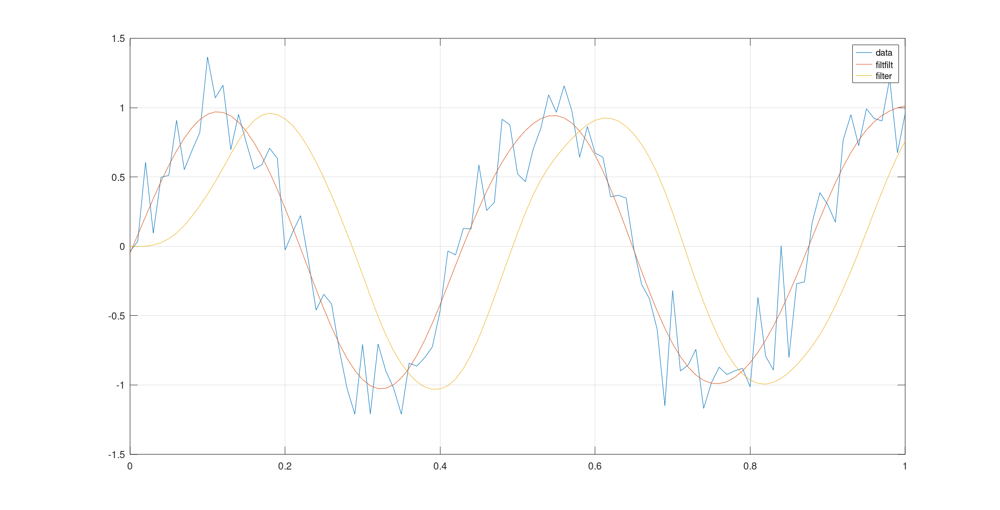

# FiltFilt

Digital Filter implementation, with and without initialization.
Also including the filtfilt function, as known from GNU Octave/Matlab.

## Install 

#### Compile the static library
```console
$ git clone https://github.com/KBaur/FiltFilt.git
$ cd ./FiltFilt/build
$ sudo bash ./build_and_install_lib.sh
```
[folder](build/build_and_install_lib.sh)

## Platforms
 * Linux
 * Windows
 * macOS

## Features
* Based on the implementation of 
Likhterov & Kopeika, 2003. "Hardware-efficient technique for minimizing startup transients in Direct Form II digital filters"
* Simple Filter implementation with and without initialization
* Zero-Phase Filter implementation with filtfilt
* Window filtering is following
 
## Usage samples

#### Basic usage
```c++
#include <iostream>
#include <vector>
#include <sstream>
#include <fstream>

#include "FiltFilt.h"

int main() 
{
    kb::math::FilterCoefficients<double> fc{ 
        m_CoefficientsA:{1.0000,-2.374094743709352,1.929355669091215,-0.532075368312092}, 
        m_CoefficientsB:{2.898194633721429e-03,8.694583901164288e-03,8.694583901164288e-03,2.898194633721429e-03}
    };

    std::vector<double> signal = splitCsv("../FiltFilt/samples/signal1.csv");

    kb::math::Filt<double> filt(fc);
    kb::math::FiltFilt<double> filtfilt(fc);
    
    auto filtered = filt.Filter(signal);
    auto zeroPhaseFiltered = filtfilt.ZeroPhaseFiltering(signal);
}

```
### Result of the example


## Documentation

Doxygen documentation will be generated

---


